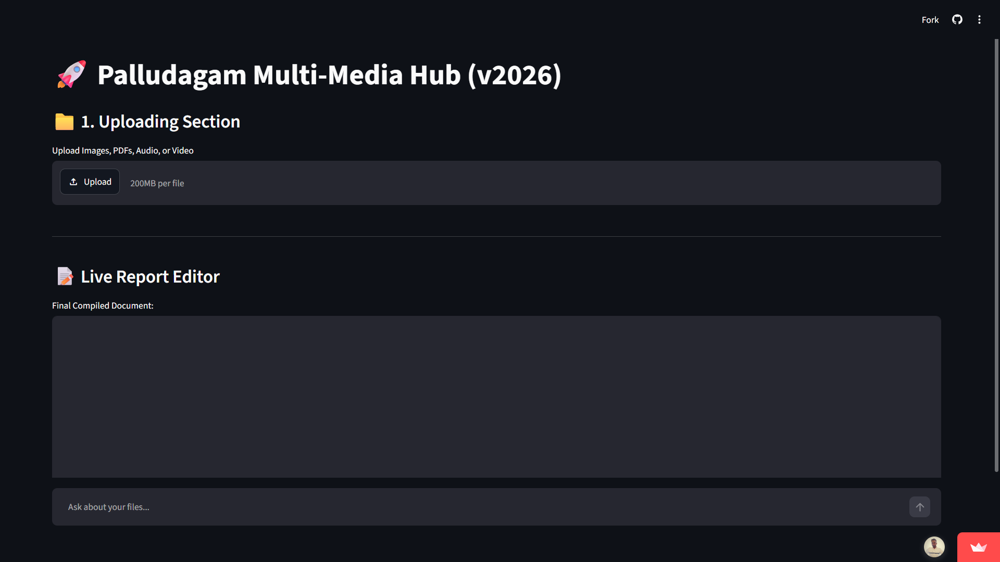
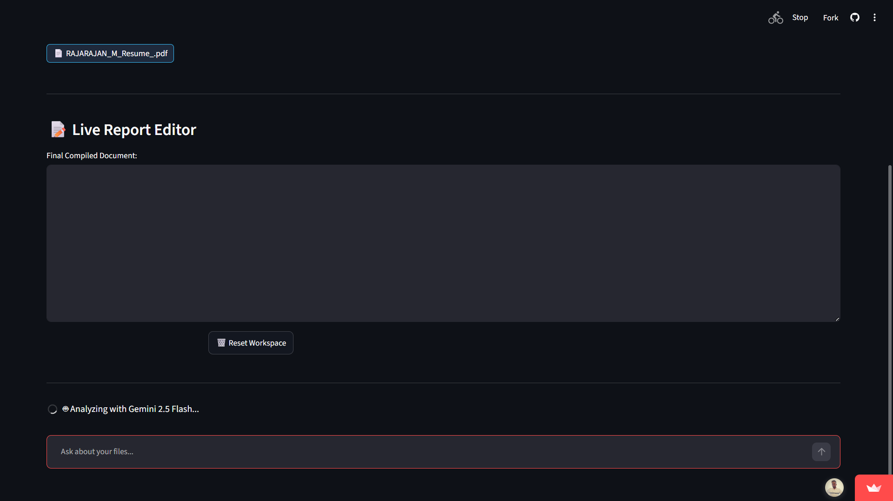
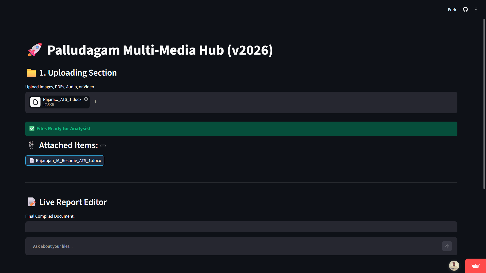
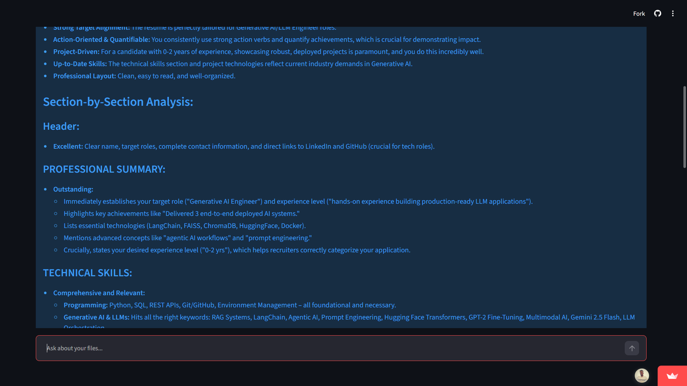

# 🤖 Palludagam AI: Multimodal Intelligence Hub

**Palludagam AI** is a cutting-edge multimodal application that leverages the power of **Google Gemini 2.5 Flash** to analyze and interpret complex data across different formats—Images, Audio, and PDFs. 

Built with **Python** and **Streamlit**, and fully **Containerized using Docker**, this project demonstrates a complete end-to-end AI deployment pipeline.

---

## 🚀 Live Demo & Deployment
Experience the application live or pull the production-ready container:

* **🌐 Live App (Streamlit Cloud):** https://rajarajan71-multimodel-app-app-d8u5i2.streamlit.app/
* **🐳 Docker Hub Image:** `docker pull rajann71/palludagam-ai-hub:v1`

---

## 🚀 Project Highlights

- Built with Gemini 2.5 Flash
- Supports Image, PDF and Audio inputs
- Dockerized for consistent deployment
- Reduced Docker image size by 40%
- Production-ready Streamlit application

# 📸 Application Demo

## 🏠 Home Page

The landing page of Palludagam AI where users can select the type of content they want to analyze.



---

## 📤 File Upload

Upload Images, PDF documents, or Audio files for AI-powered analysis.



---

## ⏳ AI Processing

The application processes the uploaded content using Google Gemini 2.5 Flash.



---

## 🧠 AI Generated Output

Displays detailed AI-generated insights, summaries, and responses based on the uploaded content.



  
## ✨ Key Features
* **Multimodal Analysis:** Upload images, audio files, or PDFs and get instant AI-generated insights.
* **Gemini 2.5 Flash Integration:** High-speed, high-accuracy processing using Google's latest Generative AI models.
* **Enterprise-Ready DevOps:** Fully containerized using Docker to ensure "it works on every machine."
* **User-Friendly UI:** Clean, intuitive interface built with Streamlit for seamless interaction.

---

## 🛠️ Technical Stack
* **Language:** Python 3.12
* **AI Engine:** Google Gemini SDK (`google-generativeai`)
* **Frontend:** Streamlit
* **DevOps:** Docker, Docker Hub

---

## 📦 Local Setup & Installation

### Option 1: Using Docker (Recommended)
You don't need to install Python or any libraries. Just run:
```bash
docker pull rajann71/palludagam-ai-hub:v1
docker run -p 8501:8501 rajann71/palludagam-ai-hub:v1
